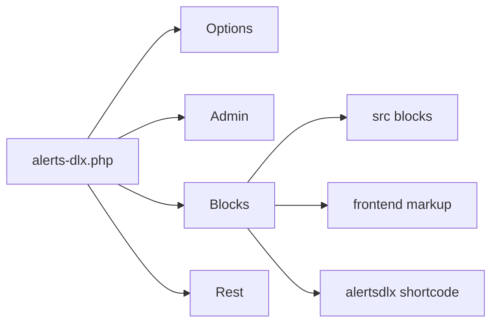

# Architecture

How AlertsDLX boots, renders alerts, and stores settings. Keep this file accurate when you change those flows.

## Runtime bootstrap



1. WordPress loads `alerts-dlx.php`.
2. Composer autoload (`lib/autoload.php`) maps `DLXPlugins\AlertsDLX\` → `php/`.
3. On `plugins_loaded`, `AlertsDLX::plugins_loaded()` starts:
   - `Options::run()` — reserved for migrations; options are read via `Options::get_plugin_options()`.
   - `AlertLibrary::run()` — Private `alerts_dlx_library` CPT for global styles (and future snapshots).
   - `Admin::run()` — Settings screen and AJAX save/retrieve/reset.
   - `Blocks::run()` — Block registration, editor/frontend assets, shortcode.
   - `Rest::run()` — REST search for the button URL picker and alert library CRUD.
4. Fires `do_action( 'alerts_dlx_loaded' )` for extenders.

A custom content pipeline `alerts_dlx_the_content` (embed, autop, shortcodes) processes alert description content without relying solely on `the_content`.

## PHP classes (`php/`)

| Class | Responsibility |
|-------|----------------|
| `Options` | Defaults, allowlists, get/sanitize/save for option key `alerts_dlx` |
| `Admin` | Settings → AlertsDLX menu, enqueue admin React app, AJAX handlers |
| `Blocks` | Register blocks from `build/`, render callback, shortcode, asset enqueue |
| `AlertLibrary` | CPT `alerts_dlx_library`, meta `_alerts_dlx_kind` + `_alerts_dlx_config`, kind-aware sanitize |
| `Rest` | `search/pages` and `library-items` REST routes |
| `ShortcodeBuilder` | Shortcode builder AJAX; global style field allowlists |
| `Functions` | Paths, URLs, capability helpers, shared utilities |

### Options storage

Option name: `alerts_dlx`.

Defaults (see `Options::get_defaults()`):

- `headline_style` — `h1`–`h6` or `div` (allowlisted)
- `headline_custom_classes` — extra classes on titles
- `headline_force_size` — boolean
- `enabled_block_styles` — which of `bootstrap`, `chakra`, `material`, `shoelace` appear in the inserter
- `debug_mode` — boolean
- `options_version` — string for future migrations

Disabling a theme hides it from the inserter only; existing content still renders.

### Blocks and shortcode

Block names (stable — do not rename lightly):

- `mediaron/alerts-dlx-bootstrap`
- `mediaron/alerts-dlx-chakra`
- `mediaron/alerts-dlx-material`
- `mediaron/alerts-dlx-shoelace`

Registration uses `build/js/blocks/` + `build/blocks-manifest.php` via `wp_register_block_types_from_metadata_collection` (with fallbacks).

All four blocks share the same PHP render callback: `Blocks::frontend()`. The shortcode `[alertsdlx]` maps attributes into the same markup path via `Blocks::shortcode()`.

### Assets

- **Block editor JS/CSS**: built by `@wordpress/scripts` into `build/` from `src/index.js` and block metadata under `src/js/blocks/`.
- **Theme styles, fonts, dismiss script, admin app**: custom webpack config → `dist/` (entries such as `alerts-dlx-bootstrap-styles`, `alerts-dlx-dismiss`, `alerts-dlx-admin-settings`).
- Frontend loads only styles needed for alerts present on the page (and dismiss JS when close buttons are used).

### Admin settings

- Menu: Settings → AlertsDLX (`settings_page_alerts-dlx`).
- Tabs: **Settings**, **Shortcode Builder**, **Global Styles** (`tab=global-styles`).
- UI: React apps in `src/react/Settings/`, `src/react/ShortcodeBuilder/`, `src/react/GlobalStyles/` → `dist/alerts-dlx-admin-*.js`.
- Site options persistence: admin-ajax actions `alerts_dlx_retrieve_settings`, `alerts_dlx_save_settings`, `alerts_dlx_reset_settings` (capability `manage_options`, nonces required).

### Alert library (global styles v1)

- Post type: `alerts_dlx_library` (not public; admin-only).
- Meta: `_alerts_dlx_kind` (`global_style` | `snapshot`), `_alerts_dlx_config` (JSON appearance config).
- Global styles store an appearance allowlist only (`ShortcodeBuilder::get_global_style_input_names()`); preview uses a fixed Lorem ipsum fixture in the admin UI.
- Slugs are unique **per kind** (`post_name` scoped by `_alerts_dlx_kind`).
- REST: `GET/POST dlxplugins/alerts-dlx/v1/library-items`, `GET/PUT/DELETE .../library-items/{id}`, `POST .../duplicate` (`manage_options`).
- Filter: `alerts_dlx_global_style_config` when reading global style config from a library post.

## Frontend / editor JS (`src/`)

```
src/
  index.js                 # Registers all blocks + editor plugins
  js/blocks/
    bootstrap|chakraui|material|shoelace/   # Per-theme block.json + edit.js
    plugins/               # Shared editor chrome (toolbar, colors, icons, etc.)
    components/            # Shared React UI
    utils/                 # Style helpers, transforms, SVG sanitize
  js/dismiss/              # Cookie/session dismiss behavior on the frontend
  react/Settings/          # Admin settings app
  scss/                    # common + per-theme stylesheets
```

Chakra’s source folder is named `chakraui/` on disk; the block name and CSS group remain `chakra`.

Shared editor behavior lives in `plugins/` so all themes stay consistent (style toolbar, visibility toggles, close expiration, editorial-only, inner blocks, icon picker).

## Styling contract

Visual appearance is driven by attributes that become CSS classes. Details and examples: [styles.md](../styles.md).

Do not change class patterns or attribute semantics without considering existing content and third-party CSS.

## Dismissible alerts

When a close button is enabled, frontend dismiss JS (`src/js/dismiss`) hides the alert and remembers the choice according to `closeButtonExpiration` (session or timed cookie). High-level user docs live in the docs repo.

## Release artifacts

| Artifact | Audience |
|----------|----------|
| `readme.txt` | WordPress.org (version, FAQ, changelog) |
| `README.md` | GitHub |
| `alerts-dlx.zip` via `npx grunt` | Packaged plugin (PHP, lib, dist, build, assets, readme) |
| [alerts-dlx-docs](https://github.com/MediaRon/alertsdlx-docs) | End-user / developer documentation site |

Source maps and `node_modules` are not part of the Grunt zip.
